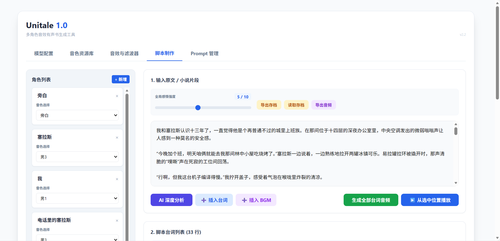
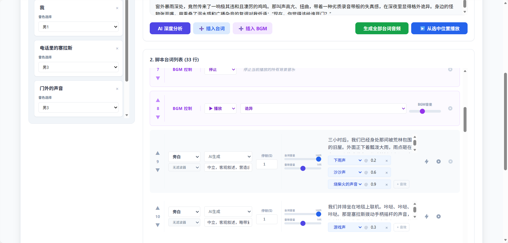
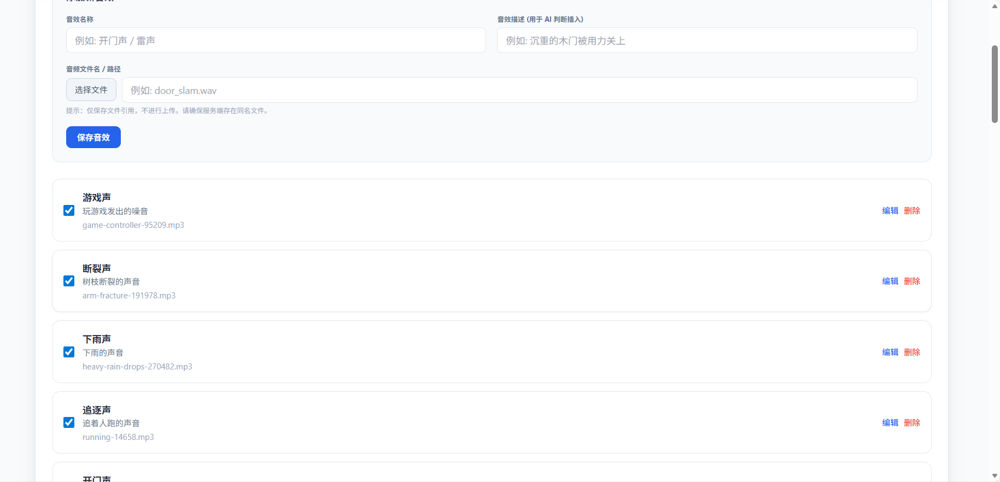

# Unitale

一个基于Indextts的 AI 有声书制作工具。利用 LLM 自动拆解剧本与识别情绪，集成多角色 TTS 语音合成，支持音效(SFX)、背景音乐(BGM)混音及实时台词音频滤波器的自动插入和匹配，可直接在浏览器导出 WAV 成品。

界面简洁，使用简单，能够一键生成，用户可以对生成的音频内容进行微调。

在线使用页面（须自行配置LLM和IndexTTS2的API）：

https://sdsds222.github.io/Unitale/

IndexTTS 2 免费云原生项目：
https://cnb.cool/ConyStudio/index-tts-v2
启动后在前端输入云原生项目的Ip地址即可调用

## 核心功能:

一个自制的 AI 有声故事生成工作台。利用 LLM 深度理解小说文本，实现了音效自动插入、BGM 自动切换、场景滤波器自动设置以及多角色情绪自动演绎的完整自动化编排，在浏览器中一键生成有声音频作品。

AI 自动音效编排：系统能够深度理解文本中的动作描写与环境氛围，自动从本地素材库中检索匹配的音效，并精确计算其在台词念白过程中的插入时间点，无需人工手动对轨。

AI 动态配乐系统：AI 实时分析剧情的情绪起伏与转折，自动判断背景音乐的切入、停止与无缝切换时机，实现配乐与剧情发展的同步。

AI 场景感知滤波器：系统自动检测特殊的对话场景（如“电话通话中”、“内心独白”、“水下对话”、“广播通知”），并自动为对应台词挂载实时音频滤波器，还原真实的物理声场听感。

深度情绪与角色演绎：自动拆分小说段落，精准区分旁白与不同角色，并根据上下文推断角色的情绪强度，产生情绪描述提示词，指导 TTS 生成有感染力的语音表演。

## 本地化与导出:

支持导出/导入工程文件 (.json)，保存所有编辑状态。

高度可配置: 自定义 Prompt 模板、情绪预设、音色库和音效素材库。

