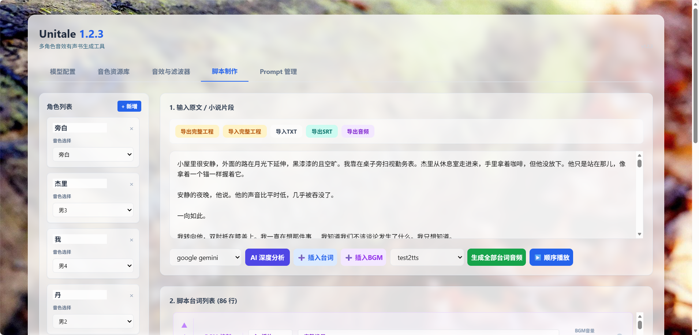
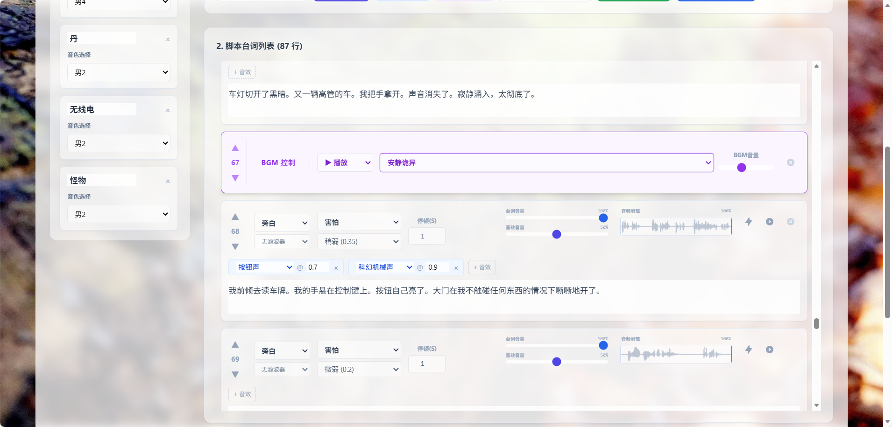
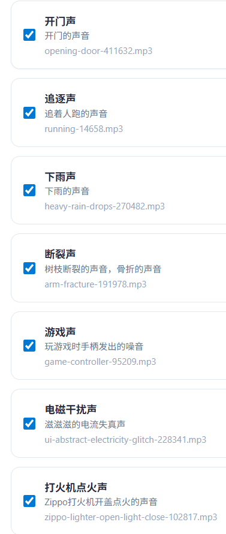
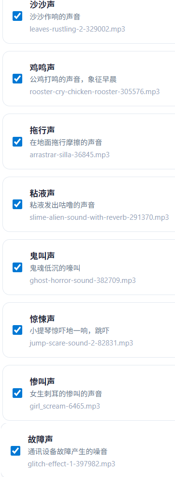

# Unitale AI有声书制作工具

[![Bilibili](https://img.shields.io/badge/dynamic/json?logo=data%3Aimage%2Fpng%3Bbase64%2CiVBORw0KGgoAAAANSUhEUgAAAGAAAABgCAYAAADimHc4AAAD7ElEQVR4nO2dW9WrMBCFK6ESkFAJSKiESqgEHCABCZWAhEpAAhL2ecik5dDc%2FpXLBDLfWnlqy0xmJ5BMQnq5CIIgCIIgCIIgCIIgCEIBAHQAemYfrgCunD6wAKAHsEKxALgx+bCQD8%2FS9tmgVqeDr1lLigDgZvDhXso+K9TyTBQRwRJ8AHjntl0Flh5QRAQK%2FmKxPeayWx2OXpBNBKiHvi34b7T2MC4pAvW6twR%2FRwkRKPizBN8CgEcuESj4Lwm+BwBjahEk+H8EwJRKhOaCDzW8e1JLfkUUH1NgmR3XmHffHR1l+72BSs8d7w8U+JDAnZERQMcV+CtUi7dNqFqibB4J7vtrq7xKCuAasbTMXCL4T+5aVk6+2xHUrWdhruAR6HIJcOeu2UHI8zyAe2ytWfEdWz9PVvQ8YAmIQ5dDAB9LFsMVAv8oMO2zAGrC5WNIarRiAuKR9jYEd9pY08aa6uUzIHGRdkgKd8pY0yc1WjEBAqypDYoAG0QAZkQAZkQAZkQAZk4vANQenjsSzS3I%2FwcSbXU5jQBUkRtdf4Rar90v8kSv3+I3ffCCSpk8I%2Fw+lgDkdI%2Fv2rEp2CaiWm1AsDQLlDAD+dlFXLMeAaCSeLZdaSFE5VUQNot38cKuEeBgAsSuG0flVZBmEanbXfNQAsS0fgBYIn2fIu3%2FBBMHEyBmDXlFfA8IzeHb+Ems4WAChKykrVA9ZfsQTL57jXzRg4A5wC%2FA8N4ADiZAZwm2XjW75Qh2KOTfA0p4kygPw28OJcCVgn3nDnYo2EwEYRgGH0qAMyICMCMCMCMCMCMCMCMCMCMCfP3qwHDOQ4AAUekTk8FaBRihJnZdYbvtCGC7LvmkM63GjVDINPFrQgCq5ETXfmMzI90FXzPvfqt7x4rEu%2FZaEcCUxFvgz2zO+BUn6UkoaEEAsptiMSX5e8FoRYCN7cVgb4Vq7U%2FH50Pq4JNP7Qiw8UFnJwcK+tXy+Wj6PLEvPgHSHv5UgwA1IQIwwyFAyLJin9RoxYgAzAQIkPwNmf26busC+OIx5TDqo5nDT+F%2FSS%2F9CYzwb+No49zNy2evkYv0LywGGAXUvp6eSneycqOic0w20k7CNgKE7jJunSGLACTCxF27ylmQc98T5MQUH49swd+I0HPXslLKnT0N+wnkrTKi9JZL%2FL9i1SorMmdeQ4TQQ7OFMxIMzGD45w8nUL1im7efENZLJpgPSw0pfz0cdt4U3230Td%2FTvx2R6d2FrHhEWLkq5PELOMsRPHCPnAZGv1xJteL7jbJiaW3sB2nDvPC%2FosSYvjRQz4cJ6n7KO3rYQL7M+L6nVtfDVRAEQRAEQRAEQRAEIZ5%2FSAXmdfXaoQsAAAAASUVORK5CYII%3D&label=bilibili+fans&labelColor=FE7398&color=282c34&query=%24.data.totalSubs&url=https%3A%2F%2Fapi.spencerwoo.com%2Fsubstats%2F%3Fsource%3Dbilibili%26queryKey%3D11354448&longCache=true)](https://space.bilibili.com/11354448)
[![Coolapk](https://img.shields.io/badge/dynamic/json?logo=data%3Aimage%2Fsvg+xml%3Bbase64%2CPHN2ZyBjbGFzcz0iaWNvbiIgdmlld0JveD0iMCAwIDEwMjQgMTAyNCIgeG1sbnM9Imh0dHA6Ly93d3cudzMub3JnLzIwMDAvc3ZnIiB3aWR0aD0iNjQiIGhlaWdodD0iNjQiPjxkZWZzPjxzdHlsZS8+PC9kZWZzPjxwYXRoIGQ9Ik0xMjcuODkzIDQyNi42NjdjMjkuOTItNjYuOTg3IDk0LjUwNy0xMTYuNjk0IDE2Ni40LTEzMC4zNDcgNTUuNzg3LTkuNiAxMTIuOTYgNS4wNjcgMTYxLjkyIDMxLjk0N0M0OTcuNzYgMzQ5LjQ0IDUzNC40IDM3OC44OCA1NjcuOTQ3IDQxMS4wNGMtMTYuMTYgMTguNC0zOS4wOTQgMjguODUzLTU3LjQ5NCA0NC43NDctNDYuMTMzLTM4Ljg4LTk2LjY0LTc3LjcwNy0xNTcuOTczLTg3LjA5NC03OC45MzMtMTMuMTczLTE1OC41NiA0OS4yMjctMTcwLjUwNyAxMjcuMTQ3LTguNjkzIDQ1LjkyIDEwLjEzNCA5NC42NjcgNDUuMTc0IDEyNC45MDcgMzkuNjggMzQuOTg2IDk3LjIyNiA0NC41ODYgMTQ3LjYyNiAzMS4yNTMgNTcuNi0xMy45MiAxMDEuOTc0LTU3LjA2NyAxMzYuODU0LTEwMi43NzMgNTQuMDgtNzIuMTA3IDk5LjItMTUwLjQgMTQ3Ljg0LTIyNi4xMzQgMTMuOTItMTkuMTQ2IDQ3LjQxMy0xNy4yMjYgNTguNzIgMy44NCA2My42MjYgMTA5LjAxNCAxMjYuMDggMjE4LjcyIDE4OS42IDMyNy43ODcgNy41NzMgMTUuMDkzIDQuNDI2IDM1Ljc4Ny05LjYgNDYuMTMzLTEzLjA2NyAxMC42MTQtMzMuMzM0IDEwLjI0LTQ2LjEzNC0uNjkzYTk3MDY2LjU1OCA5NzA2Ni41NTggMCAwMS0yMjYuMTg2LTE2Mi43MmMxOC44OC0xNS4wNCAzOC40LTI5LjMzMyA1Ny45NzMtNDMuNDY3IDIzLjczMyAxMi45MDcgNDMuNzg3IDMzLjE3NCA2OS42IDQxLjY1NC0yMC4zNzMtMzkuNTc0LTQzLjYyNy03Ny43MDctNjYuMzQ3LTExNS45NDctNDIuNjY2IDU5LjE0Ny03Ny4wNjYgMTI0LjIxMy0xMjMuMTQ2IDE4MS4wNjdDNTE2IDY2My40NjcgNDQ4LjggNzE2Ljk2IDM2OC42NCA3MjguNDhjLTM4Ljg4IDMuNDEzLTc5LjMwNyA0LjIxMy0xMTYuMzczLTkuOTczLTUzLjQ5NC0xOS4xNDctMTAwLjMyLTU4LjcyLTEyNC41ODctMTEwLjU2LTI4LjIxMy01Ni4xMDctMjYuNzczLTEyNS4wMTQuMjEzLTE4MS4yOHoiIGZpbGw9IiNmZmYiLz48L3N2Zz4%3D&label=%E9%85%B7%E5%AE%89+Coolapk&labelColor=11ab60&suffix=+fans&color=282c34&query=%24.data.totalSubs&url=https%3A%2F%2Fapi.spencerwoo.com%2Fsubstats%2F%3Fsource%3Dcoolapk%26queryKey%3D457536&longCache=true)](https://www.coolapk.com/u/457536)

一个基于Indextts的 AI 有声书制作工具。利用 LLM 自动拆解剧本与识别情绪，集成多角色 TTS 语音合成，支持音效(SFX)、背景音乐(BGM)混音及实时台词音频滤波器的自动插入和匹配，可直接在浏览器导出 mp3 成品，本工具本体无需配置环境即可跨平台在浏览器使用。

先看使用教程：https://www.bilibili.com/video/BV1KSzWByEy7

界面简洁，使用简单，能够一键生成，用户可以对生成的音频内容进行微调。

b站生成效果演示视频：

https://www.bilibili.com/video/BV1AkzLB7E8M

https://www.bilibili.com/video/BV1v2kjB5EKV

https://www.bilibili.com/video/BV1jYkGBqEkL

### 工具在线使用页面（须自行配置LLM和IndexTTS2的API）：

https://sdsds222.github.io/Unitale/

现已支持台词剪辑和优化编辑器保存功能。

### IndexTTS 2 免费云原生项目：

https://cnb.cool/ConyStudio/index-tts-v2

Fork云原生仓库后，即可点击按钮在线启动部署，启动后，在前端TTS配置界面输入云原生项目的port里面的Ip地址即可调用。

IndexTTS的api接口务必使用 https://cnb.cool/ConyStudio/index-tts-v2 的api.py写的接口定义规范，不然不能正常调用。

### LLM使用OpenAI通用接口
LLM支持使用各种支持OpenAI通用接口的大模型。

本人测试使用的是Gemini的Openai通用接口。输入Base URL：https://generativelanguage.googleapis.com/v1beta/openai   以及你的APIKEY即可设置完成。

### 音频资源整合包
可以在编辑界面点击保存工程按钮，能够保存音色、音效、BGM、滤波器和脚本编辑工作台的所有信息，一定要记得经常保存，页面清空后可以用存档文件恢复所有工作状态。

新手可以先使用制作好的初始工程整合包，里面提供了基础的音色、音效、BGM供使用，在本项目目录里，Unitale工程文件.json

## 核心功能:

一个自制的 AI 有声故事生成工作台。利用 LLM 深度理解小说文本，实现了音效自动插入、BGM 自动切换、场景滤波器自动设置以及多角色情绪自动演绎的完整自动化编排，在浏览器中一键生成有声音频作品。

AI 自动音效编排：系统能够深度理解文本中的动作描写与环境氛围，自动从本地素材库中检索匹配的音效，并精确计算其在台词念白过程中的插入时间点，无需人工手动对轨。

AI 动态配乐系统：AI 实时分析剧情的情绪起伏与转折，自动判断背景音乐的切入、停止与无缝切换时机，实现配乐与剧情发展的同步。

AI 场景感知滤波器：系统自动检测特殊的对话场景（如“电话通话中”、“内心独白”、“水下对话”、“广播通知”），并自动为对应台词挂载实时音频滤波器，还原真实的物理声场听感。

深度情绪与角色演绎：自动拆分小说段落，精准区分旁白与不同角色，并根据上下文推断角色的情绪强度，产生情绪描述提示词，指导 TTS 生成有感染力的语音表演。

音频资源库默认为空，可以导入项目文件夹里面的json工程存档获取音频资源库，或者按照下面截图的配置进行手动填写：

SFX场景音效资源库:

BGM背景音乐资源库：

## 本地化与导出:

支持导出/导入工程文件 (.json)，保存所有编辑状态。

高度可配置: 自定义 Prompt 模板、情绪预设、音色库和音效素材库。

